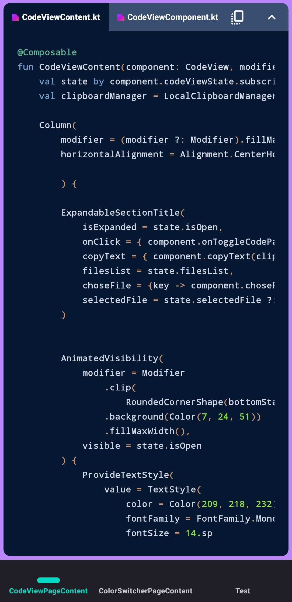

# UIPolygon — UI Sandbox & Playground ✨

**UIPolygon** — это кроссплатформенная "песочница", созданная на **Kotlin Multiplatform (KMP)**. Проект предназначен для изучения и прототипирования сложных интерфейсов, анимаций и архитектурных решений в мире Compose.

---
## 📸 Галерея скриншотов

|                Просмотр кода                |
|:-------------------------------------------:|
|            |

---

## 🚀 Текущие возможности

### 🎨 Динамическая смена тем
*   Полная поддержка **Light/Dark** режимов на лету.
*   Сохранение состояния темы между перезапусками приложения с использованием **Multiplatform Settings**.
*   Реактивное обновление UI через `StateFlow` без лишних перерисовок.

### 🧭 Продвинутая навигация
*   Реализована на базе **Decompose** для строгого управления жизненным циклом компонентов.
*   **Custom Scrollable BottomBar**: Горизонтальное меню навигации, вмещающее любое количество вкладок (отображение по 3 элемента на экране).
*   Плавные анимации переходов между экранами (`Fade`, `Scale`).

### 💻 Виджет отображения кода (Code Viewer)
*   Интеграция библиотеки **Highlights** для полноценной подсветки синтаксиса Kotlin.
*   **File Swapping**: Возможность переключения между несколькими файлами исходного кода внутри одного виджета.
*   Чтение кода напрямую из ресурсов проекта (`composeResources/files`).
*   Механика быстрого копирования кода в буфер обмена.

---

## 🏗 Архитектура и Стек

*   **UI**: Compose Multiplatform (Android, Desktop).
*   **Navigation & Lifecycle**: [Decompose](https://github.com/arkivanov/Decompose).
*   **Architecture**: **MVI** (Model-View-Intent) с использованием компонентного подхода.
*   **Storage**: [Multiplatform Settings](https://github.com/russhwolf/multiplatform-settings) + Kotlinx Serialization.
*   **Async**: Kotlin Coroutines & Flow.

---
## 🛠 Установка и запуск
1.  **Клонировать репозиторий:**
    ```bash
    git clone https://github.com/Nikita0504/UI-Polygon.git
    ```
2.  **Запуск на Android:**
    Выбери конфигурацию `composeApp` в Android Studio и нажми **Run**.

---
*Разработано с использованием возможностей Kotlin Multiplatform.*
